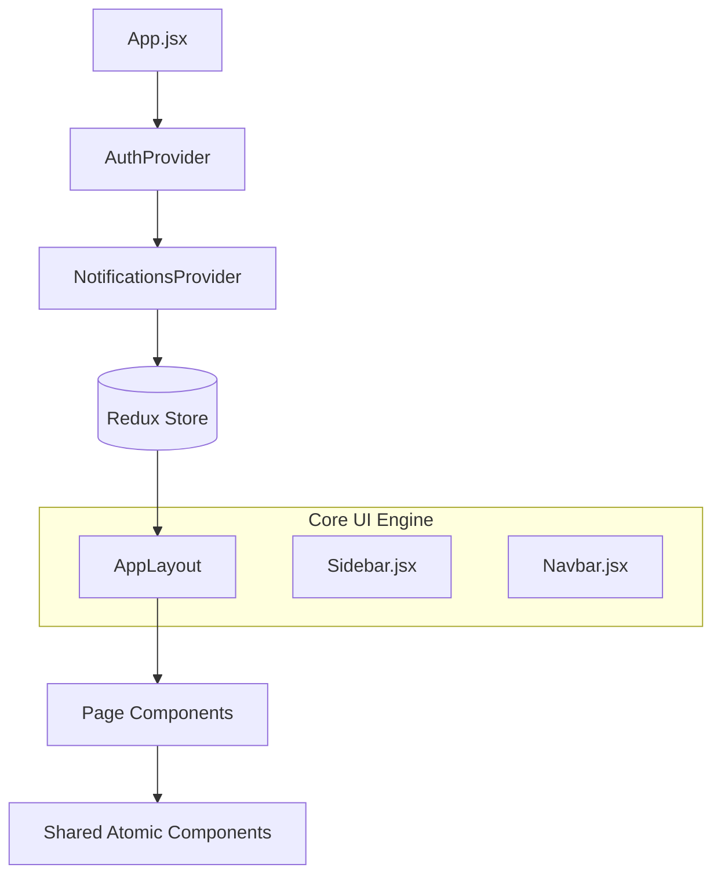
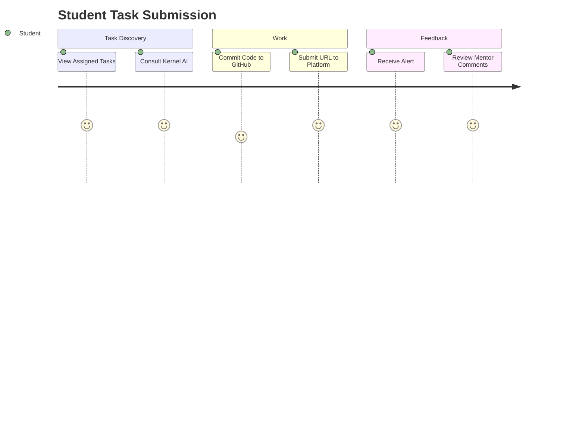

# ColdStart Frontend — High-Fidelity Technical Blueprint 💎

The ColdStart Dashboard is a premium React 18 application designed with the **Liquid Glass** aesthetic. It integrates Redux Toolkit for complex state management, Framer Motion for physics-based animations, and Axios for synchronized data communication.

## 📐 Frontend Architecture & Component Flow

The application is structured around a centralized **Redux Store** and a custom **Context Provider** layer to manage global state and UI-level alerts.

### Component & State Hierarchy


---

## 🧠 State Management (Redux Toolkit)

The global state is partitioned into specialized slices to maintain a predictable unidirectional data flow.

### Store State Tree
- **`auth`**: `session` (Supabase), `user` (DB Row), `role-checks`.
- **`tasks`**: `items[]`, `currentTask` (with submissions), `loading`.
- **`notifications`**: `items[]`, `unreadCount`.
- **`chat`**: `messages[]` (AI history).
- **`admin`**: Platform-wide stats and late submission tracking.

### Data Synchronization Flow
1. **Action**: UI triggers an `Async Thunk` (e.g., `fetchMyTasks`).
2. **Network**: Axios Interceptor attaches JWT -> Backend Request.
3. **Store**: Payload is normalized and stored in the Redux Slice.
4. **Reactive UI**: Memoized selectors (`useSelector`) trigger atomic re-renders only where needed.

---

## 🎨 "Liquid Glass" Design System
The design system emphasizes visual excellence and transparency.

| Category | Token | Technical Implementation |
| :--- | :--- | :--- |
| **Colors** | `surface` | `#0D0D0D` (Deep matte black) |
| **Accents**| `accent` | `#22C55E` (Emerald-500) |
| **Effects**| `glass` | `backdrop-blur-xl` + `bg-white/5` |
| **Shadows**| `glow` | `0 0 12px #22C55E40` |

### Animations (Framer Motion)
- **Entrance**: `fade-up` variants with staggered children.
- **Interactions**: Hover-scaling and physics-based slide drawers.
- **Loading**: Custom shimmer-gradient skeleton loaders.

---

## 🔐 User Journey & Flows

### 1. Onboarding Flow
- **Email Check**: Validates if the user is in the `allowlist`.
- **Signup**: Creates Supabase Auth account -> Redirects to Dashboard.
- **Session**: `useAuth` hook synchronizes the JWT session across tabs.

### 2. Task Lifecycle


---

## 📡 API & Networking Logic
Centralized in `src/lib/api.js`:
- **Interceptors**: Automatically refreshes session and injects `Authorization` headers.
- **Polling Logic**: High-activity modules (like Task Discussions) use 10s polling intervals to keep UI updated without the complexity of WebSockets.

---

## 🚀 Build & Deployment

### Local Execution
```bash
# 1. Install
npm install

# 2. Environment (.env)
VITE_API_BASE_URL=http://localhost:4000
VITE_SUPABASE_URL=...
VITE_SUPABASE_ANON_KEY=...

# 3. Start
npm run dev
```

### Production
- Optimized via **Vite 5**.
- Deployed to **Vercel** with SPA routing support.

---
*ColdStart Frontend — Crafting the standard for developer dashboards.*
